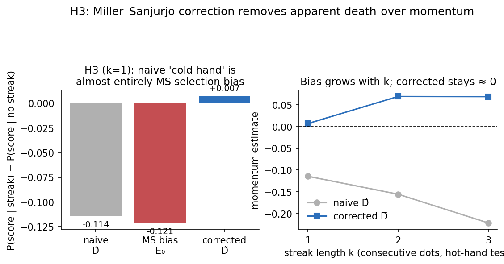

# Ghostwriter

Ghostwriter is a [Claude Code](https://claude.ai/code) skill that runs a complete research pipeline on your behalf: it surveys the literature, proposes hypotheses, designs an experiment, writes and runs the code, analyzes the results, writes the paper, and then peer-reviews its own work before showing you the final draft. You stay in the loop the whole way. The pipeline pauses at every major decision (which gap to chase, which hypothesis to test, whether the experiment design holds up, whether the results are worth writing up) and waits for your go-ahead.

The entire skill is plain Markdown: an orchestrator file plus six agent instruction files. There is no app, no server, and no API key beyond your existing Claude Code setup. If you can read a prompt, you can read (and modify) all of Ghostwriter.

## A paper it actually produced

This repo includes a complete, unedited run of the pipeline. The starting input was one question:

> Does batter/bowler identity actually matter in T20 cricket death overs, and is momentum real or a statistical artifact?

From that, the pipeline produced [The Death-Over Momentum Illusion: A Miller–Sanjurjo Correction for T20 Cricket](research-workspace/phase-5-writer/paper.md), an 18-page preprint with results computed from 223,678 real deliveries in the public Cricsheet archive. Along the way it:

- found that no cricket study had applied the Miller–Sanjurjo streak-selection correction (the result that overturned the famous basketball "hot hand" null) and imported it,
- pre-registered its predictions before running any code,
- built calibrated per-ball models of expected runs and wicket probability, with a placebo test and six seasons of rolling out-of-sample validation,
- and concluded that the apparent death-over "cold hand" is almost entirely a finite-sequence artifact: the naive momentum estimate of −0.114 becomes +0.007 after correction (p = 0.40).



Every intermediate artifact is in [research-workspace/](research-workspace/): the literature survey, the candidate hypotheses with their novelty checks, the locked experiment spec, all the analysis code, the raw result CSVs, and the LaTeX source. [docs/example-run.md](docs/example-run.md) walks through the run phase by phase. No human wrote any of the experiment code or the paper text; the human contribution was the question and the checkpoint decisions.

## How the pipeline works

```
Your idea
   |
   v
Phase 0  INTAKE        pick a research track, confirm compute and data constraints
Phase 1  SCOUT         map the literature, list gaps, untested assumptions,
   |                   and methods from adjacent fields       [checkpoint]
Phase 2  IDEATOR       propose 3-5 testable hypotheses, each checked
   |                   against the literature for novelty     [checkpoint]
Phase 3  ARCHITECT     design the experiment and pre-register predictions,
   |                   then a reviewer attacks the design
   |                   before any code runs                   [checkpoint]
Phase 4  EXPERIMENTER  write and run the code, with controls,
   |                   ablations, and a deviation log         [checkpoint]
Phase 5  WRITER        write the paper from the actual result files,
   |                   plus a claims-to-evidence audit
Phase 6  REVIEWER      adversarial review, revise until no
   |                   must-fix issues remain                 [checkpoint]
   v
Submission-ready paper
```

Each phase runs as a fresh subagent with its own instruction file, so no single context window has to hold the whole project. The orchestrator carries forward a structured context packet between phases. [docs/how-it-works.md](docs/how-it-works.md) covers the design in detail, including why pre-registration and the design review exist.

## Try it

You need Claude Code installed and authenticated. Python 3.10+ is needed for the experiment phase, and a LaTeX install (`pdflatex`) is optional, for compiled PDF output.

**Quickest path:** clone this repo and start Claude Code inside it. The skill is already in `.claude/skills/`, so Claude picks it up automatically.

```bash
git clone https://github.com/bagel786/ghostwriter
cd ghostwriter
claude
```

Then just describe a research idea:

```
I have a research idea: do code review bots actually reduce
post-merge bug rates in open source repos?
```

**To use it in any project:** the `research-pipeline.skill` file is a zip of the skill directory. Unpack it into your personal skills folder and it becomes available everywhere:

```bash
unzip research-pipeline.skill -d ~/.claude/skills/
```

Optional but recommended: MCP servers for literature search (`paper-search`, `semantic-scholar`, `exa`). Without them the scout falls back to plain web search, which works but finds less.

**What to expect from a run:** a full pipeline run takes hours of wall clock time and a serious amount of model usage, most of it in the experiment phase. The checkpoints are real stopping points, so you can run a phase, walk away, and come back. The cricket paper came together over about a day, in a few sittings with checkpoint reviews in between.

## What it can and can't do

Ghostwriter handles research that is testable with code and public data: empirical ML and statistics studies, simulations, replications, benchmarks, theory with numerical verification, methods transferred from one field to another, and meta-science on the literature itself. Pick a track at intake or let it suggest one.

Be clear-eyed about the rest:

- **It cannot run a lab.** Anything requiring physical experiments, human subjects, or private data is out of scope.
- **The novelty check is best effort.** The ideator searches for nearest-neighbor papers for every hypothesis and shows you the delta, but a literature search by an agent is not a guarantee. Treat it as a strong filter, and verify before you submit anywhere.
- **You are still the author.** The pipeline pre-registers predictions, logs deviations, audits every claim against the result files, and reviews itself adversarially, and it will still sometimes be wrong. Read the paper, read the code, and check the numbers before putting your name on anything.
- **A null result is a fine outcome.** The skill is built to publish a clean, pre-registered null rather than fish for a positive. If you want guaranteed exciting results, this will frustrate you.

## Repository layout

```
.claude/skills/research-pipeline/
  SKILL.md                  orchestrator: phases, checkpoints, failure handling
  agents/
    scout.md                phase 1: literature search and gap analysis
    ideator.md              phase 2: hypothesis generation and novelty checks
    architect.md            phase 3: experiment design and pre-registration
    experimenter.md         phase 4: code, execution, controls, reproducibility
    writer.md               phase 5: paper writing and claims audit
    reviewer.md             phases 3 and 6: adversarial design and paper review
  references/               writing guide, figure standards, LaTeX templates
research-pipeline.skill     the same skill packaged as a zip for installation
research-workspace/         the full cricket paper run, unedited
docs/                       how it works, plus a walkthrough of the example run
```

## Why this exists

Plenty of tools will write something that looks like a paper. The interesting question was whether an agent pipeline could do the underlying work honestly: find a real gap, commit to predictions before seeing data, run actual code on actual data, and survive an adversarial review of its own claims. The cricket paper in this repo is the existence proof, and the checkpoints are what kept it honest. Whether the approach holds up across more topics is exactly the kind of thing I'd like feedback on.
